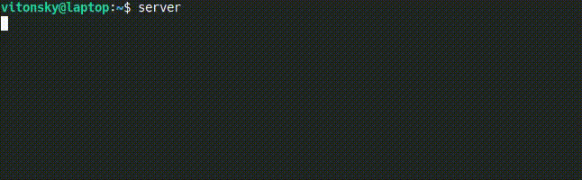

Simple and powerful time estimation (ETA).

Ideal to draw progress in CLI, web and mobile.

- Zero dependencies. Works everywhere - node, browsers, toaster, etc.
- ETA, speed measurements and average step time estimation



# Usage

Install with `npm i arrival-time` or `yarn add arrival-time`

```js
import { Estimation } from 'arrival-time';

const estimation = new Estimation();

// Update progress to 25 of 100, and get measurements
const measure1 = estimation.update(25, 100);
console.log("Estimated time", measure1.estimate); // Estimated time 0.8227890000048319
console.log("Estimated speed", measure1.speed); // Estimated speed 120322.4642033603

console.log(measure1);
// {
// 	timeDelta: 0.008311000000048807,
// 	averageTime: 0.008311000000048807,
// 	progressLeft: 99,
// 	speed: 120322.4642033603,
// 	estimate: 0.8227890000048319
// }

console.log(estimate.update(50, 100))
// {
// 	timeDelta: 9.841669000000138,
// 	averageTime: 4.920834500000069,
// 	progressLeft: 50,
// 	speed: 203.21756401276775,
// 	estimate: 39.36667600000055
// }
```

# API

### constructor

```ts
type Options = {
	// Current progress (default 0)
	progress?: number;
	// Total progress (default 100)
	total?: number;
	// Time to start count from (default - current time)
	startTime?: number;
	// Optionally, you may provide your own clock implementation,
	// that will return time as number
	timeFetcher?: TimeFetcher;
};
```

### measure(tick = 1000)

Return measurements object

```js
{
	// Time when estimation been start
	timeDelta: 9.841669000000138,
	// Average time per progress step
	averageTime: 4.920834500000069,
	// Left progress
	progressLeft: 8,
	// Speed per `tick`
	speed: 203.21756401276775,
	// Estimate in ms for complete
	estimate: 39.36667600000055
}
```

### estimate()

Return `estimate` value

### reset(time?: number)

Reset start time to current time

# Related projects

- [humanize-duration](https://www.npmjs.com/package/humanize-duration) - converts time in ms to human readable time
- [log-update](https://www.npmjs.com/package/log-update) - print and redraw messages to stdout
